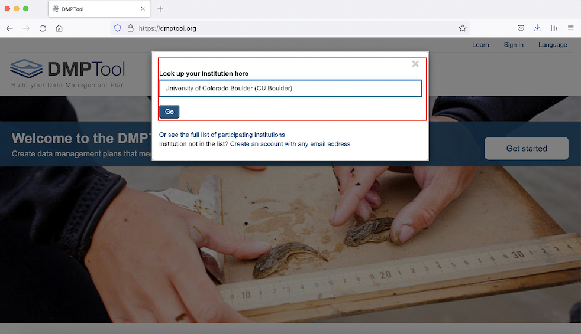
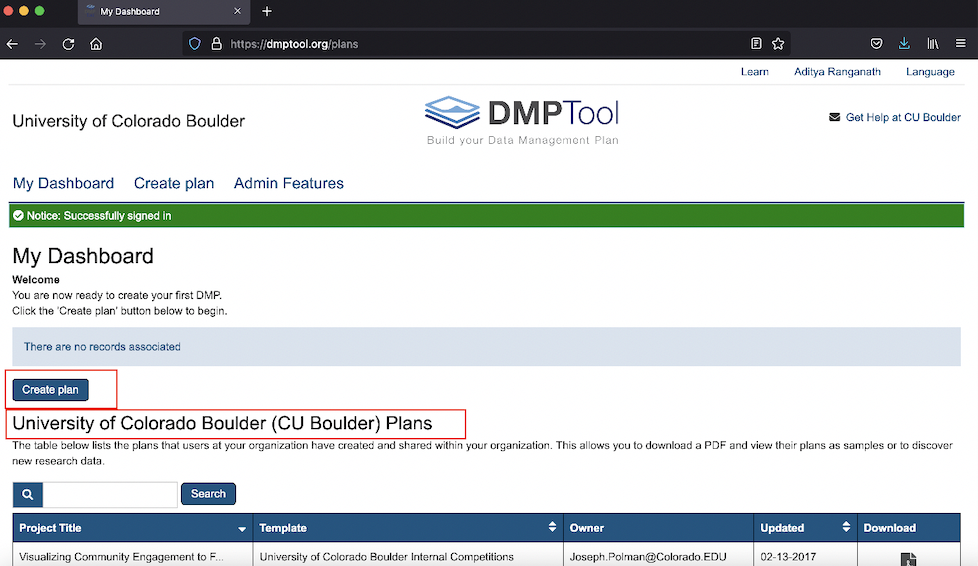

# (PART) Data Management Planning {-}

# An Overview of Data Management Planning

A data management plan (DMP) is a short document (~2 pages) that describes your plans for collecting, organizing, storing, and eventually disseminating the data that underlies your published research. These plans are increasingly required by funding agencies as a part of grant applications, and have been a requirement for NSF grant applications for some time now. One of the key features of the NIH's new DMSP is that a data management plan will now be a requirement for NIH grants as well.

The final draft of the template for the NIH data management plan is still in development, and will be released soon. However, the basic outline has already been [published on the NIH website](https://sharing.nih.gov/data-management-and-sharing-policy/planning-and-budgeting-for-data-management-and-sharing/writing-a-data-management-and-sharing-plan), and you can review it there. If you are familiar with NSF data management plans, you'll notice that the NIH draft template is quite similar.

If you are planning to apply for an NIH grant, the easiest way to generate an appropriate data management plan that conforms to NIH requirements is to use an application called [DMPTool](https://dmptool.org/). [DMPTool](https://dmptool.org/) is a digital platform that provides structured assistance to researchers that would like to craft a data management plan. It allows you to view sample plans that have been completed in the past, and develop new data management plans using DMP templates that correspond to the requirements of the major funding agencies. It also allows for easy collaboration among project teams, including among project teams that are dispersed across multiple institutions.

The NIH data management plan template has not yet been added to DMPTool, but will be included by the time the new NIH DMSP goes into effect in early 2023. Below, Section 3 walks you through the main steps involved in creating a DMP using DMPTool. Because the NIH template has not yet been added, the example uses a sample NSF template; note, however, that the workflow will be substantively quite similar for the NIH template (once it's added). 

# DMPTool

## Log into your DMPTool account and view your personal dashboard

Go to the [DMPTool](https://dmptool.org) website, and select the option to sign in via the institutional portal:

```{r, echo=FALSE, fig.cap="Sign into DMPTool via your institution"}
knitr::include_graphics("images/pic1.png")
```

Then, select University of Colorado, Boulder; once you click **Go**, you will be able to sign in via your Identikey:

```{r, echo=FALSE, fig.cap="Look up CU Boulder and click 'Go' to sign in via IdentiKey"}

```

This will bring you to your personal DMP Dashboard. Here, you can begin a new DMP; resume working on a saved DMP (in-progress DMPs will show up under the **My Dashboard** sign if they exist); or view sample DMPs created by other CU researchers (under the banner that reads **University of Colorado Boulder Plans**)

```{r, echo=FALSE, fig.cap="Your personal DMPTool dashboard"}

```

## Create a new plan

To initiate a new plan, click the blue **Create plan** button (see Figure 3.3), which will bring you to an interface like the one below: 

```{r, echo=FALSE, fig.cap="Initiate a new plan"}

```

Here, you can provide relevant details about your project, such as its name, the funding organization, and the DMP template that you would like to use. In this example, we've named our project "Demonstration", and have selected NSF and the generic NSF DMP template under the funder and template headings (but, if you'd like to prepare a DMP for an NIH grant, you would select that option once it is available in DMPTool in early 2023). Once you've filled out this information, go ahead and click the blue **Create plan** button, as in Figure 3.4. 

## Customize, Write, and Compile the Data Management Plan

At this point, we are on a page that looks something like the one below. Note the six tabs running along the top of the page:

```{r, fig.cap="Environment to assemble DMP", echo=FALSE}

```

By systematically working through the various sections associated with these tabs, you will be able to generate a data management plan. Make sure to save your work on the sections as you go. 

Also, note the **Select Guidance**  section on the right. Make sure that both the **DMPTool** and **University of Colorado Boulder (CU Boulder)** buttons are selected. This ensures that as you work through the material within the **Write Plan** tab, you will be able to see relevant guidance on how to complete various sections of your DMP. 

In the first tab, **Project Details**, you can enter your project abstract and some additional information. The second tab, **Collaborators**, will look like the image below; here, you can invite collaborators to participate in creating the DMP, and regulate their access to the in-progress document.

```{r, echo=FALSE, fig.cap="Add collaborators"}

```

Once you've invited collaborators (if relevant) and set their permissions, you can click the **Write Plan** tab, which will bring you to a page that looks like the one below. Each section on this page corresponds to a required section of the DMP (these sections are based on the template that was chosen earlier). Click the **+** to expand a section and work on it, or click **expand all** to open all the sections at once. 

```{r, echo=FALSE, fig.cap="Write DMP sections"}

```

To take an example, let’s expand the **Data and metadata standards** section, which will look like the image below, once open. We can write (or paste) the text for this section into the text box, and click **Save** (note that it’s necessary to click **Save** after every DMP section within the **Write Plan** tab is completed). 

```{r, echo=FALSE, fig.cap="Completing an individual section within the 'Write Plan' tab"}

```

On the right of the image above, you can view relevant information on a section or advice on how to complete it. To view this information, make sure that the **Guidance** button is selected (when selected, it will appear white). Once the **Guidance** button is selected, you'll see buttons corresponding to different sources. To see instructions from the funding agency (here, NSF) or DMPTool itself, click on those buttons. To see CU Boulder-specific information on completing a given section (i.e. information on CU-specific resources or tools that might be relevant to a given section), click the **CU Boulder** button. There is CU Boulder-specific guidance for all sections in the **Write Plan** tab (assuming we’re using the generic NSF template) with the exception of the first section (on Types of data produced). 

## Download and Export the DMP

After completing the various sections of the DMP within the **Write Plan** tab, and adding relevant information within the **Research outputs** tab, you can download your DMP (which is compiled from the information that has been entered in the various tabs), within the **Download** tab. The **Download** section will look something like this:

```{r, echo=FALSE, fig.cap="Download DMP"}

```

After customizing the plan according to the desired specifications, you can then click **Download Plan**, at which point DMPTool will generate a complete data management plan in the desired file format (in this case, PDF), based on the text that was entered in the various sections above.

When opening up the exported file, it will look something like this:

```{r, echo=FALSE, fig.cap="Exported DMP opened in new tab"}
knitr::include_graphics("images/pic10.png")
```

## Have someone review the draft DMP 

After generating a draft DMP using DMPTool, it is often useful to have someone review and offer feedback on your draft. In particular, we encourage CU researchers to reach out to the [Center for Research Data and Digital Scholarship](https://www.colorado.edu/crdds/), which has librarians who are able to review DMPs, and offer advice on possible revisions before you submit the plan to the funding agency. To set up an appointment with a CRDDS librarian, please send an email to [crdds@colorado.edu](mailto:crdds@colorado.edu). 

## Revise the DMP

To implement revisions, you can access your DMP (and its various sections) from your personal DMPTool dashboard. Simply click on the relevant project title, and DMPTool will take you back into that project, where you implement necessary revisions to the relevant sections, and then re-export the revised DMP:

```{r, echo=FALSE, fig.cap="Access DMP from dashboard to make revisions"}

```

Also, note that it's not necessary to complete the DMP in one session; so long as you save the DMPTool sections as you go, it's always possible to return to an in-progress or incomplete DMP from your dashboard, and continue working where you left off. 

## Submit the DMP

While the specific submission process for the DMP will depend on the funding agency and grant, it's useful to note that DMPTool provides useful options for publishing and registering your DMP within the **Finalize/Publish** tab of your project (including the option to generate a DMP ID and add the plan to ORCID):

```{r, echo=FALSE, fig.cap="Options to publish and/or register your plan  "}

```

# Sample DMPs

As noted above, DMPTool provides a catalog of DMPs written and used by researchers as part of their grant applications. This [searchable archive of previously used DMPs](https://example-dms-plans.github.io/examples/) provides additional examples that you may wish to explore. Another useful resource is this [annotated example of a DMP in the provisional NIH 2023 format](https://osf.io/euaty), which has been released by the [NIH DMSP Guidance Working Group](https://osf.io/uadxr/). 

Perusing previously-submitted DMPs will give you a sense for the level of detail that reviewers expect in these documents. 


# (PART) Implementation {-}

# Implementation Services

# Data Management Best Practices

# (PART) Data Publishing {-}

# Repository Services

# (PART) Conclusion {-}


